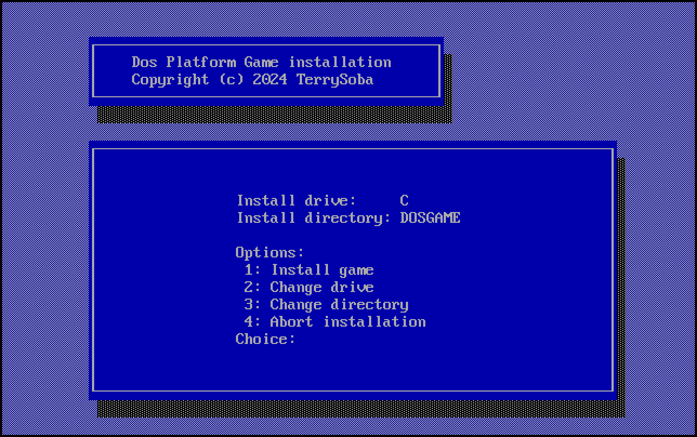

= Yar Compression Tools (lzg based)

This repository contains a set of tools for compressing and decompressing YAR files.
The compression algorithm used is link:https://liblzg.bitsnbites.eu/[liblzg] v1.0.10.

This repository contains the following tools:

 * `compressor` - Compresses files into YAR files on Linux. May work on other OSes, but only tested on Linux.
 * `unyar.exe` - Decompresses YAR files on DOS. Should work on any DOS (8086/8088 and up) with enough ram.
 * `install.exe` - A DOS based installer that installs programs compressed using the compressor. Should work on any DOS (8086/8088 and up) with enough ram.

== Installer Screenshots

Here are some screenshots of the installation of link:https://github.com/TerrySoba/DosPlatformGame[DosPlatformGame], a game that uses the installer.

== Installer

`install.exe` can be used to create installers for DOS programs. Just compress the file of your application using `compressor` and adjust the file `install.ini`:

[source,ini]
.Example of install.ini
----
target_name=My Example Application
version=0.1

date=2024
copyright=My Name

link=https://github.com/TerrySoba/DosInstaller
directory_name=MYAPP
archive_name=myapp.yar
game_executable=MYAPP
----
