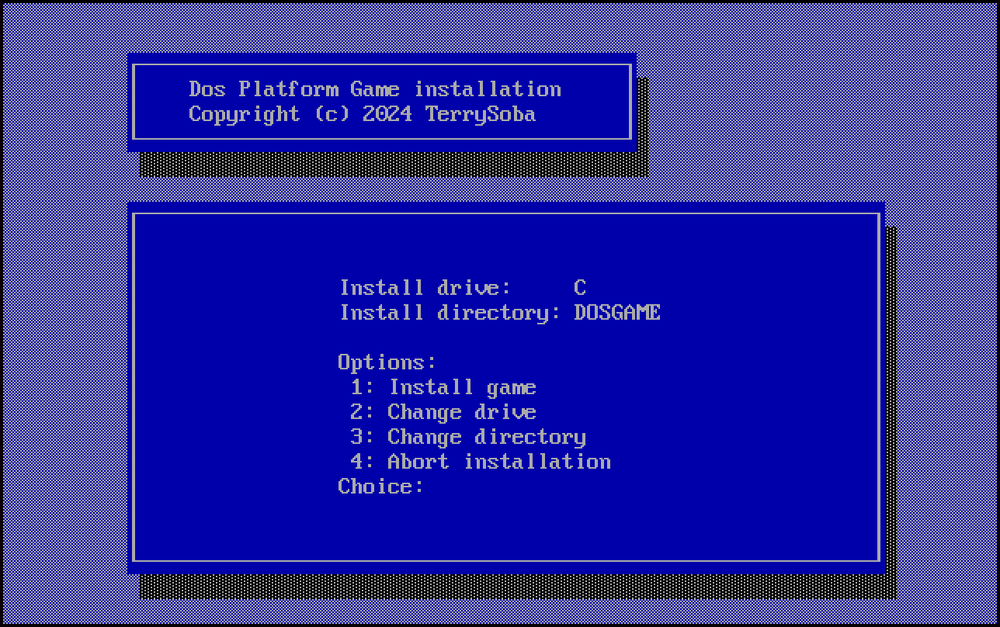

= DosInstaller

 * `install.exe` - A DOS based installer that installs programs compressed using self extracting archives. Should work on any DOS (8086/8088 and up) with enough ram.

== Installer Screenshots

Here are some screenshots of the installation of link:https://github.com/TerrySoba/DosPlatformGame[DosPlatformGame], a game that uses the installer.

== Installer

`install.exe` can be used to create installers for DOS programs. Just compress the file of your application using a self extracting archive, e.g. link:https://aminet.net/package/util/arc/msdos-lha[lha], and adjust the file `install.ini`:

[source,ini]
.Example of install.ini
----
target_name=My Example Application
version=0.1

date=2026
copyright=My Name

link=https://github.com/TerrySoba/DosInstaller
directory_name=MYAPP
archive_name=myappsfx.exe
game_executable=MYAPP
----
